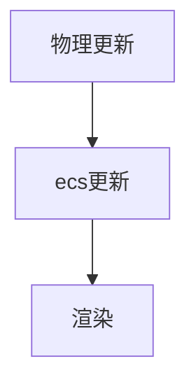

# 框架
## 权衡与选择
从最开始到第一个demo都是用的ecs架构（参考的hyperlap2d的gdx runtime实现。）  
之后越鼓捣物理引擎越发现一些事情比如：  
1. 筛选视图内的对象用来渲染，直接在物理引擎里可以做，而不需要一个system来循环每个entity更新位置
2. 如果我做化学合成的功能，如果用system循环来做，相当于做一个碰撞检测，而物理引擎里已经有了碰撞检测，直接碰撞事件的callback就可以了。   

结论是这个游戏的底层做一些机制不适合ecs架构，要围绕物理引擎来做，用传统的oop。没浪费太多时间，之前大部分时间在看文档。  
而一些游戏逻辑比如热量过高扣血量还是可以的，并行处理也方便用stream api。 
## 游戏循环

